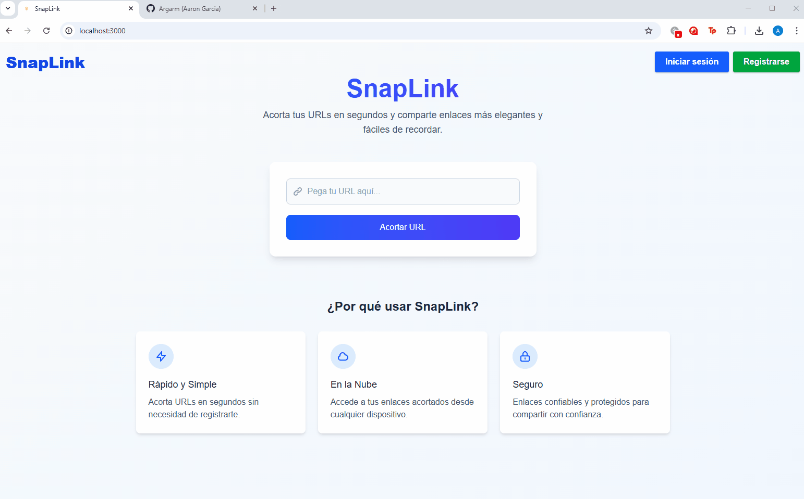

# 🚀 SnapLink · URL Shortener

SnapLink es un servicio moderno para acortar URLs, pensado para compartir enlaces de forma rápida, elegante y segura.

---

## ✨ Características

- 🔗 Acorta URLs largas en segundos
- ⚡ Redirección instantánea y seguimiento de clics
- 🛡️ Validación y seguridad integradas
- 🗑️ Expiración automática de enlaces (TTL 90 días)
- 🖥️ Interfaz intuitiva y responsiva (Next.js + Tailwind CSS)
- 🚀 Listo para despliegue en Vercel

---

## 📸 Demo



---

## 🛠️ Tecnologías

- **Next.js** (App Router)
- **TypeScript**
- **Tailwind CSS**
- **MongoDB** + **Mongoose**
- **Validator.js**
- **Vercel** (deploy recomendado)

---

## 🚀 Instalación y uso local

1. **Clona el repositorio:**
   ```bash
   git clone https://github.com/argarm/snaplink.git
   cd snaplink
   ```

2. **Instala dependencias:**
   ```bash
   npm install
   # o yarn / pnpm / bun
   ```

3. **Configura variables de entorno:**
   - Crea un archivo `.env.local` y agrega tu cadena de conexión de MongoDB:
     ```
     MONGODB_URI=mongodb://localhost:27017/snaplink
     ```

4. **Inicia el servidor de desarrollo:**
   ```bash
   npm run dev
   ```

5. Abre [http://localhost:3000](http://localhost:3000) en tu navegador.

---

## 🧩 Scripts útiles

- `npm run dev` — Servidor de desarrollo
- `npm run build` — Compila para producción
- `npm run start` — Servidor en modo producción
- `npm run lint` — Linter de código

---

## 📦 Despliegue

Despliega gratis en [Vercel](https://vercel.com/new?utm_source=github&utm_medium=readme&utm_campaign=snaplink) en segundos.

---

## 📚 Documentación

- [Documentación Next.js](https://nextjs.org/docs)
- [Tailwind CSS](https://tailwindcss.com/docs)
- [Mongoose](https://mongoosejs.com/docs/guide.html)

---

## 🤝 Contribuciones

¡Las contribuciones son bienvenidas! Abre un issue o un pull request para sugerir mejoras.

---

## 📝 Licencia

MIT
